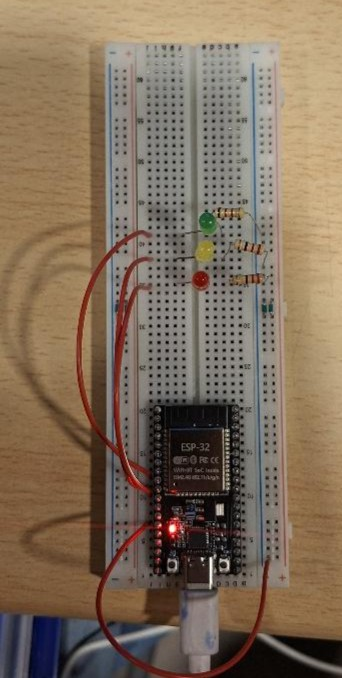
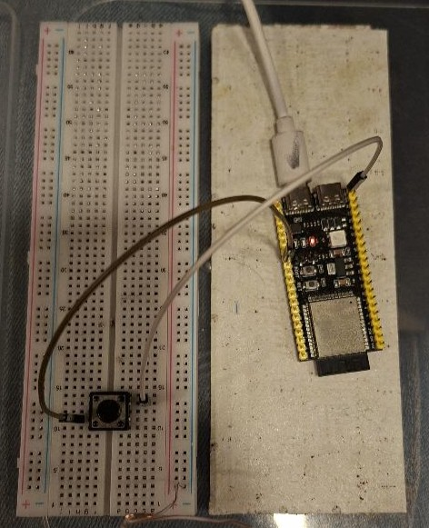

# Proyecto Domotica - Evaluación Sumativa 3: Sistema Domótico IoT

Un sistema centralizado de Internet de las Cosas (IoT) diseñado para monitorear y controlar el estado de una vivienda inteligente. Este proyecto integra un backend en Python (Flask), una base de datos relacional en la nube (Supabase) y dos microcontroladores ESP32 con roles específicos.

## Arquitectura del Proyecto

El sistema se divide en tres capas principales:
1. Frontend y Backend: Un servidor Flask alojado en una máquina virtual con AmogOS. La interfaz web está diseñada estrictamente sin JavaScript, utilizando de manera exclusiva identificadores de CSS para los estilos.
2. Base de Datos (Nube): Supabase almacena un registro histórico en tiempo real de cada interacción (luces encendidas/apagadas y alertas de pánico).
3. Capa de Hardware: Dos placas ESP32 con roles independientes que interactúan directamente con el entorno físico.

---

## Justificación de Hardware (Roles de los ESP32)

Para este proyecto, se implementaron dos microcontroladores con responsabilidades claras y separadas:

### ESP32 N°1: Módulo Actuador (Control de Luces)
* Función: Actúa como el actuador del sistema. Se encarga de recibir instrucciones desde el servidor central a través de peticiones HTTP para consultar el estado de la casa.
* Acción: Enciende o apaga físicamente los LEDs correspondientes a la Sala, Patio y Clima según el estado de la base de datos.

### ESP32 N°2: Módulo Sensor (Sistema de Seguridad)
* Función: Actúa como el sensor del sistema. Monitorea constantemente un botón de hardware (simulando un botón de pánico o intrusión).
* Acción: Al detectar una pulsación, envía inmediatamente una alerta al servidor para registrar un evento de seguridad directamente en la tabla de Supabase.

---

## Esquema de Conexiones Físicas

| Dispositivo | Componente      | Pin Físico (GPIO) | Tipo         |
| ----------- | --------------- | ----------------- | ------------ |
| ESP32 N°1   | LED Sala        | GPIO 25           | OUTPUT       |
| ESP32 N°1   | LED Patio       | GPIO 26           | OUTPUT       |
| ESP32 N°1   | LED Clima       | GPIO 27           | OUTPUT       |
| ESP32 N°2   | Botón de Pánico | GPIO 0            | INPUT_PULLUP |

Nota de red: Ambos ESP32 y el servidor operan bajo una red de Punto de Acceso Móvil dedicada para garantizar la comunicación y evitar bloqueos de red institucional.
